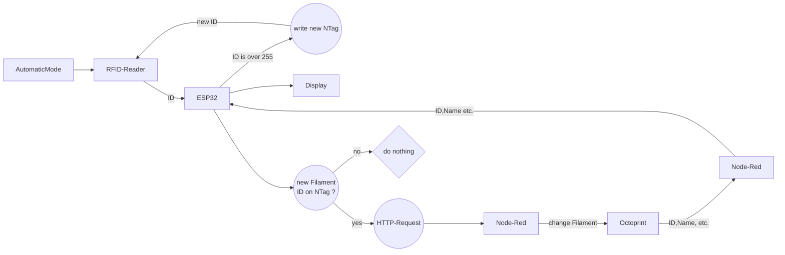

# RFID-Spool-Selector
**This is work in progress !!!!!!!!!!**

Hi! Here is my first project on GitHub. 
My 3D Printer stands in the garage and my Laptop is in the Diningroom inhouse. I use Octoprint on a RPi 4 1GB. To select the current filament in filamentmanager-plugin I must go inhouse, select the desired filament, go back and change filament. To optimize the worklow I bought a LCD/TFT-Display with touch from pollin.de and installed TouchUI. But this was to small and inperformant. So I planned a method/project to change the filament in filament-plugin directly.

# How to
**Hardware** 
- ESP32-Dev Board
- MFRC522 RFID Reader
- ST7735 SPI 1.8 TFT
- Rotary Encoder
- NTag-RFID Tags

**Software:**
 - [Octoprint](https://octoprint.org/) 
	 - [Filamentmanager-Plugin](https://plugins.octoprint.org/plugins/filamentmanager/)
 - MQTT-Broker
 - [Node-Red](https://nodered.org/)
 - [VS-Code](https://code.visualstudio.com/)/[Atom](https://atom.io/) with [Platformio](https://platformio.org/) or [Arduino](https://www.arduino.cc/)
	 - [TFT_eSPI library](https://github.com/Bodmer/TFT_eSPI)
	 - [MFRC522 library](https://github.com/miguelbalboa/rfid)
	 
Compile Sketch in Arduino or Platformio. 

## How does it works?

<!--stackedit_data:
eyJoaXN0b3J5IjpbLTQ1NTc0OTYxLDI3NDkwNzYzNl19
-->
